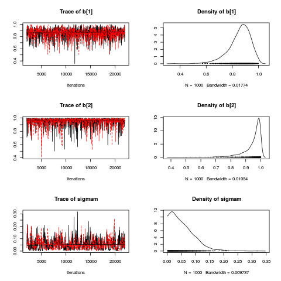

# Estimating the mtDNA Bottleneck

This contains code that was used to analyse the mitochondrial bottleneck 
in the manuscript 

**Mitochondrial DNA Sequence Characteristics Modulate the Size of the Genetic Bottleneck**

*Wilson, Carling, Alston, Floros, Pyle, Hudson, Sallevelt, Lamperti, Carelli, Bindoff, Samuels1,  Wonnapinij,
  Zeviani, Taylor, Smeets, Horvath & Chinnery*.  

The contents of this can be downloaded by using 

```
git clone https://github.com/ijwilson/mtBottleneck.git
```

On any system that has git.  Alternativelty use [this link](https://github.com/ijwilson/mtBottleneck/archive/master.zip) to download a zipped archive.

### Prerequisites

To run the code here you need [JAGS](http://mcmc-jags.sourceforge.net/), [R](https://cran.r-project.org/) and the R packages [coda](https://cran.r-project.org/web/packages/coda/index.html ), [rjags](https://cran.r-project.org/web/packages/rjags/index.html) and [ggplot2](https://cran.r-project.org/web/packages/ggplot2/index.html).


### Data Structure

JAGS allows you to use R data structures to run code.  The structure for the main analyses in the paper 

### Basic Data

This is the data structure used in simulations.  The data is a list with the following components.  

* **NFam**:  The number of families
* **N**:  A vector with the family size for each of the **NFam** families.
* **Nmuts**: The number of different mutations
* **mutation**: A vector with the mutation number for each of the mutations.  Must be an integer between 1 and **Nmuts**
* **parent**: The heteroplasmy level of the parents.  This is a vector of numbers between 0 and 1 of length **NFam**
* **off**:  A matrix with **NFam** rows, and **max(N)** columns.  $off_{i,j}$ gives the heteroplasmy of child j from family i.  $off_{ij}$ for j>k where $N_i=k$ are ignored.

A small example dataset is included in the file `R/example.R`. 

```
## A small example dataset
example <- list(
    NFam = 5,
    N = c(3,2,1,2,2),
    Nmuts = 2,
    mutation = c(1,1,1,2,2),
    parent = c(0.02,0.08,0.85,0.55,0.32),
    off = matrix(c(0.01, 0.13, 0.19,
                 0.01, 0.27,   NA,
                 0.58,   NA,   NA,
                 0.48, 0.52,   NA,
                 0.26, 0.31,   NA)
               , ncol=3, byrow=TRUE)
)

```


#### With publication and censoring

Frequency estimates are bounded by 0 and 1, and the beta distribution does not allow values that reach 0 and 1.  To deal with this we allow censoring at 0 and 1.  To do this we need extra variables for the parental heteroplasmy and the offspring heteroplasmy.

* **censor.off** is a matrix the same size as off, which is 0 for all those places where off=0, and 2 for all places where off=1, otherwise 1.
* **censor.parent** is a vector the same size as parent, which is 0 for all those places where parent=0, and 2 for all places where parent=1, otherwise 1.

The we need to replace all values where off=0 or off=1 by NA, and the same for parent.


We can also include the technique or the lab that was used to obtain the estimates.  To do this we add another two variables.  

* **Npub** gives the lab/technique or publication code
* **publication** is a vector of length **N** which gives the publication code for each family.  This should lie between 1 and **Npub**. 


### JAGS Models

#### Simple Model for Basic Data

```
## 
##   Simple Model without censoring
##
model {                               ## meaurement loop
  for (i in 1:NFam) {                 ## loop over families 
    parent[i] ~ dnorm(p[i],taum)      ## measurement error for parent
    for (j in 1:N[i]) {               ## iterate over siblings
      off[i,j] ~ dnorm(y[i,j], taum)  ## measurement error for offspring
      y[i,j] ~ dbeta(alpha[i], beta[i]) T(0.0001,0.9999) 
    }
  }

 for (i in 1:Nmuts) {
    b[i] ~ dnorm(bmean,taubb)T(0,1)
 }

  for (i in 1:NFam) {                
    p[i] ~ dunif(0,1)                 ## prior for the mother's heteroplasmy  
    alpha[i] <- p[i]*b[mutation[i]]/(1-b[mutation[i]])
    beta[i] <- (1-p[i])*b[mutation[i]]/(1-b[mutation[i]]) 
  }
  
  sigmam ~ dunif(0, 0.4)
  taum <- pow(sigmam,-2)

  bmean ~ dunif(0,1)
  taubb <- pow(sigmabb,-2)
  sigmabb ~ dunif(0,1)              ## measurement error
}
```

### Adding Publication

The full model used in the paper is in the file [jags/censored_pubmutbeta.jag](jags/censored_pubmutbeta.jag)

## R Code

### Simple Example

The file `R/example.R` gives simple code for the simple data example.  Starting R and souring this file produces the output

```  
Loading required package: rjags
Loading required package: coda
Linked to JAGS 4.0.0
Loaded modules: basemod,bugs
Compiling model graph
   Resolving undeclared variables
   Allocating nodes
Graph information:
   Observed stochastic nodes: 15
   Unobserved stochastic nodes: 20
   Total graph size: 150

Initializing model

  |++++++++++++++++++++++++++++++++++++++++++++++++++| 100%
  |**************************************************| 100%
  |**************************************************| 100%
```



## Ascertainment Bias Simulation


The file [prepareSimData.R](R/prepareSimData.R) allows you to simulate data under three types of ascertainment for a bottleneck.

The R code to simulate, run a JAGS analysis and plot output is in teh file [compareMotherSibling.R](compareMotherSibling.R).

Eventually this file should produce three simulated sets
of results for mother-child pairs that are ascertained through the mother, through the proband (child),
or through a sibling of the child.  

We can see that ascertainment through the proband produces a biased estimated of inbreeding.


